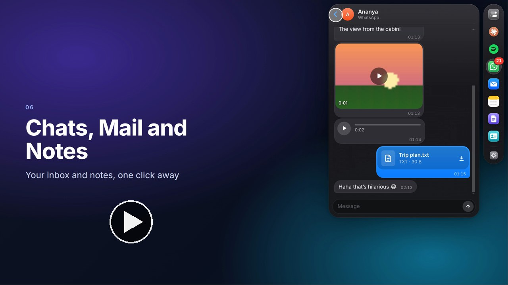

# Dynamic Island for Linux

A Mac-style **Dynamic Island** for Ubuntu (X11 + GNOME): a small black capsule on
the edge of your screen (right side by default, drag it anywhere along the left or
right edge) that morphs with spring physics to show what's going
on (music, WhatsApp messages, new mail, Claude Code permission prompts,
notifications), lets you **reply right from the island**, **talk to Claude Code**
and see your **Claude plan limits**, and opens a mini Control Center when you
click it. Everywhere outside the island, your desktop stays fully clickable.

It's a generic project: anyone can install it on Linux, and the `mac` and
`windows` branches run it on macOS and Windows too (see [Install](#install)).
Every integration (Claude Code, WhatsApp, mail) is optional.

## This is the Windows branch

This branch runs the island on **Windows 10 and 11**. It has everything on
`main`, plus a Windows module (`electron/platform/win32.ts`) for the parts
that differ. To set it up, follow [Install on Windows](#install-on-windows).

What's different on Windows:

| | On Windows |
|---|---|
| Island | A floating bar along the screen edge or at the top center, always on top; it starts with Windows if you turn that on in Settings |
| Now Playing | Any app in Windows' media overlay: **Spotify**, browsers (YouTube and others), Media Player and more, with cover art, controls, seeking, shuffle and repeat where the app allows it |
| Control Center | **Volume** and mute, **Wi-Fi** and **Bluetooth** on and off, and **brightness** on laptop screens (external monitors don't let Windows set it) |
| Other apps' notifications | Not available yet: Windows only lets packaged Store apps read them |
| Frosted glass | Not yet (Glass and Solid looks both work) |
| Shortcuts | **Ctrl+I** opens the panel, **Ctrl+Alt+Space** talks to the assistant |
| Claude Code | The hook talks to the island over a named pipe; `npm run hook:install` sets it up as on Linux |
| Everything else | The same as on Linux: the assistant (any AI), characters, Documents, CRM, Notes, WhatsApp, Mail, Spotify, voice |

Media and system controls use a small PowerShell helper that ships with the
app (nothing to install).

## Download

**Latest release: [v0.1.0](https://github.com/shashanksharma280201/dynamic-island-linux/releases/tag/v0.1.0)** ([all releases](https://github.com/shashanksharma280201/dynamic-island-linux/releases)). Pick the
file for your computer:

| Your computer | Download |
|---|---|
| Ubuntu, Debian | [dynamic-island-linux-0.1.0-amd64.deb](https://github.com/shashanksharma280201/dynamic-island-linux/releases/download/v0.1.0/dynamic-island-linux-0.1.0-amd64.deb), then `sudo apt install ./dynamic-island-linux-0.1.0-amd64.deb` |
| Any Linux (X11) | [dynamic-island-linux-0.1.0-x86_64.AppImage](https://github.com/shashanksharma280201/dynamic-island-linux/releases/download/v0.1.0/dynamic-island-linux-0.1.0-x86_64.AppImage), then `chmod +x` it and run it |
| Mac with Apple silicon (M1 and newer) | [dynamic-island-linux-0.1.0-arm64.dmg](https://github.com/shashanksharma280201/dynamic-island-linux/releases/download/v0.1.0/dynamic-island-linux-0.1.0-arm64.dmg) |
| Mac with Intel | [dynamic-island-linux-0.1.0-x64.dmg](https://github.com/shashanksharma280201/dynamic-island-linux/releases/download/v0.1.0/dynamic-island-linux-0.1.0-x64.dmg) |
| Windows 10 or 11 | [dynamic-island-linux-0.1.0-x64.exe](https://github.com/shashanksharma280201/dynamic-island-linux/releases/download/v0.1.0/dynamic-island-linux-0.1.0-x64.exe) |

The installers aren't signed yet. On a Mac, open the `.dmg`, drag Dynamic
Island to Applications, and the first time open **System Settings → Privacy &
Security** and click **Open Anyway**. On Windows, if SmartScreen warns, click
**More info**, then **Run anyway**. To build it from the code instead, see
[Install](#install).

## Watch the tour

[](docs/media/dynamic-island-tour.mp4)

A narrated, 3 minute tour of everything the island does: the capsule, Now
Playing, WhatsApp and mail replies, the panel, the assistant, Settings,
Documents, the CRM, Spotify, Claude Code, and how to install it. Click the
picture to play it ([download the video](docs/media/dynamic-island-tour.mp4?raw=true)).
It's recorded from the real app with made-up data; `scripts/video/make.sh`
records it again after changes.

## Install

Pick your computer's system below and run its commands in order, one at a
time. Each system has its own branch of this repository: `main` is the Linux
version, and the `mac` and `windows` branches have everything on `main` plus
what that system needs. The commands below fetch the right branch for you.

| Your computer | Branch | Steps |
|---|---|---|
| Linux: Ubuntu or another GNOME desktop on X11 | `main` | [Install on Linux](#install-on-linux) |
| macOS 11 Big Sur or newer, Apple silicon or Intel | `mac` | [Install on macOS](#install-on-macos) |
| Windows 10 or 11, 64-bit | `windows` | [Install on Windows](#install-on-windows) |

**Just want the app?** Download a ready-made installer for your system from
[Releases](https://github.com/shashanksharma280201/dynamic-island-linux/releases/latest)
(`.deb` or AppImage for Linux, `.dmg` for Mac, `.exe` for Windows). The steps
below build it from the code instead.

Everything works without any accounts. Claude Code, WhatsApp, mail, Spotify
and the AI assistant are all optional and set up later from the island's
Settings.

### Install on Linux

Open a terminal (`Ctrl+Alt+T` on Ubuntu).

**1. Install Git and Node.js 22** (skip if `node -v` already prints v18 or newer):

```bash
sudo apt update && sudo apt install -y git curl
curl -fsSL https://deb.nodesource.com/setup_22.x | sudo -E bash -
sudo apt install -y nodejs
node -v
```

**2. Get the code and its parts** (a few minutes the first time):

```bash
git clone -b main https://github.com/shashanksharma280201/dynamic-island-linux.git dynamic-island
cd dynamic-island
npm install
```

**3. Try it:**

```bash
npm start
```

The island appears on the right edge of the screen. Close it with `Ctrl+C` in
the terminal, or **Quit** in its tray menu (top right).

**4. Install it as an app** so it's in your app launcher:

```bash
npm run package
sudo apt install ./dist/dynamic-island-linux-*-amd64.deb
dynamic-island-linux &
```

**5. Start it at login:** click the island's tray icon (top right) and tick
**Start at login**.

On Wayland, the island shows but clicks only partly work: at the login screen,
click the gear icon and choose **Ubuntu on Xorg**. More options (AppImage,
Claude Code, demos) are in [Quick start](#quick-start).

### Install on macOS

Open **Terminal** (Applications → Utilities → Terminal).

**1. Install Git** (macOS asks to install the command line tools; click
**Install**, then wait for it to finish. If it says they're already installed,
go on):

```bash
xcode-select --install
```

**2. Install Node.js 22:** download the **macOS Installer (.pkg)** for the LTS
version from [nodejs.org/en/download](https://nodejs.org/en/download) and open
it. (With Homebrew, `brew install node` works too.) Then check it in a **new**
Terminal window:

```bash
node -v
```

**3. Get the code and its parts** (a few minutes the first time):

```bash
git clone -b mac https://github.com/shashanksharma280201/dynamic-island-linux.git dynamic-island
cd dynamic-island
npm install
```

**4. Try it:**

```bash
npm start
```

The island appears on the right edge of the screen and its icon in the menu
bar (top right). Close it with `Ctrl+C` in Terminal, or **Quit** in the menu
bar icon.

**5. Install it as an app:**

```bash
npm run package
open dist/*.dmg
```

Drag **Dynamic Island** onto **Applications** in the window that opens, then
open it from Launchpad or the Applications folder. If you copied the app from
another Mac and macOS says it can't check it, open **System Settings →
Privacy & Security** and click **Open Anyway** (once).

**6. Start it at login:** click the island's menu bar icon and tick **Start at
login**.

The first time, macOS asks to let Dynamic Island control **Spotify** or
**Music** (for Now Playing) and to use the **microphone** (only when you talk
to the assistant). Click **OK** / **Allow**.

### Install on Windows

Open **Command Prompt**: press the Windows key, type `cmd`, press Enter. (Use
Command Prompt rather than PowerShell; PowerShell can block `npm` with a
"running scripts is disabled" error.)

**1. Install Git and Node.js 22** (skip any you already have):

```bat
winget install --id Git.Git -e
winget install --id OpenJS.NodeJS.LTS -e
```

Close Command Prompt and open a **new** one, so it finds them, and check:

```bat
git --version
node -v
```

(No `winget`? Download Git from [git-scm.com](https://git-scm.com/download/win)
and the Node.js LTS **Windows Installer (.msi)** from
[nodejs.org/en/download](https://nodejs.org/en/download), and keep the
default options.)

**2. Get the code and its parts** (a few minutes the first time):

```bat
git clone -b windows https://github.com/shashanksharma280201/dynamic-island-linux.git dynamic-island
cd dynamic-island
npm install
```

**3. Try it:**

```bat
npm start
```

The island appears on the right edge of the screen and its icon in the
taskbar's notification area (bottom right; it may be under the **^** arrow).
Close it with `Ctrl+C` in Command Prompt, or **Quit** in that icon's menu.

**4. Install it as an app:**

```bat
npm run package
explorer dist
```

In the folder that opens, double-click **dynamic-island-linux-…-x64.exe** and
follow the installer. If Windows SmartScreen says it protected your PC, click
**More info**, then **Run anyway** (the installer you built isn't signed).
Open **Dynamic Island** from the Start menu afterwards.

**5. Start it at login:** click the island's icon in the notification area and
tick **Start at login**.

### After installing (all systems)

**Update to the latest version** (in the `dynamic-island` folder):

```bash
git pull
npm install
npm run restart
```

`npm run restart` rebuilds the island and swaps the running one for it. If you
installed it as an app, run `npm run package` again and install the new
package over the old one.

**Use Claude Code with the island** (optional): install
[Claude Code](https://code.claude.com), run `claude` once in a terminal to log
in, then in the `dynamic-island` folder:

```bash
npm run hook:install
```

Claude Code's permission prompts now show on the island. `npm run
hook:uninstall` removes it again.

### Uninstall

The easiest way, on every system: click the island's icon in the menu bar
(macOS) or tray (Windows, Linux) and choose **Uninstall Dynamic Island…**, or
open **Settings → General → Uninstall…**. It asks first, then removes:

- the app itself (to the Trash on macOS; on Windows its own uninstaller runs;
  on Linux it asks for your password to remove the `.deb`, or deletes the
  AppImage),
- starting at login,
- the Claude Code approvals and status line it set up (your own Claude Code
  settings are kept),
- and, only if you tick **Also delete my settings, notes, CRM and sign-ins**,
  everything it saved. Files it made in your Documents folder are always kept.

From a terminal, the same thing without questions:

| System | Command |
|---|---|
| macOS | `"/Applications/Dynamic Island.app/Contents/MacOS/Dynamic Island" --uninstall --yes --delete-data` |
| Windows | `"%LOCALAPPDATA%\Programs\Dynamic Island\DynamicIsland.exe" --uninstall --yes --delete-data` |
| Linux (.deb) | `dynamic-island-linux --uninstall --yes --delete-data` |
| From source | `npm start -- --uninstall --yes --delete-data`, then delete the `dynamic-island` folder |

Leave out `--delete-data` to keep your settings and data. You can also remove it
the usual way (drag it to the Trash on macOS, **Settings → Apps → Installed
apps → Dynamic Island → Uninstall** on Windows, `sudo apt remove
dynamic-island-linux` on Linux), but that leaves its settings and the Claude
Code setup behind; Uninstall… removes those too.

## Features

| Feature | What you see | What you can do |
| --- | --- | --- |
| **Character** | The island's agent has a face: pick **Orbit** (the orb, with a face), **Bolt** (a little robot) or **Mochi** (a soft blob) in **Settings → Character** and give it a name. It acts out what the agent is doing: listening, thinking, searching, writing, working, done, needs you, something went wrong, and it sleeps on the resting capsule late at night | Click a character in Settings to switch; the previews act out every mood |
| **Edge or top capsule** | A slim black capsule docked to the right or left edge of the screen, or **at the top center, below the camera**, as a horizontal pill that grows downward like a phone's Dynamic Island. With music playing it shows the album art and a waveform | Click it (or press **Ctrl+I** anywhere) to open the panel. **Drag it** up or down the edge, across the screen to the other side, or up to the top center; it remembers the spot. Or pick **Left / Top / Right** in Settings → General |
| **Now Playing** | Album art + animated waveform while music plays in any MPRIS player: Spotify (app or web), YouTube / YouTube Music in Chrome or Firefox, VLC, Rhythmbox, … | Hover to expand: title, artist, progress bar (click it to seek), previous / play-pause / next, shuffle and repeat |
| **Panel (Controls / Chats / Mail / Notes / Documents / CRM)** | Opens on click or **Ctrl+I**, with a slim column of icons floating beside it (like a detached dock) that remembers the last section. The Chats and Mail icons show a red badge with your unread count, and the Claude icon has two rings showing your session (outer) and weekly (inner) plan usage, turning orange at 80% and red at 95% | Click an icon to switch between the Control Center, your WhatsApp chats, your mail inbox, your notes, your documents and your CRM at any time, not only when something new arrives. The gear at the bottom opens Settings. **Ctrl+I** again (or moving the pointer away) closes it |
| **WhatsApp** | New messages pop up as a card per chat. **Chats** lists your recent chats with coloured avatars, a one-line preview, time and unread count, plus a search field. Conversations show bubbles with times, "Today / Yesterday" dividers and coloured sender names in groups. Photos and videos show as pictures (tap for full size), voice notes play right there, and files open with one tap (saved to Downloads) | Reply from the card or from the conversation view, search chats, **Mark as Read**, **Open Chats** |
| **Notes** | Your notes, newest first, with a search field | **+** starts a new note (ready to type), click one to open and edit it, the trash icon deletes it. Notes save automatically as you type, as plain Markdown files on this computer |
| **Mail** | New mail pops up as a card. **Mail** lists your recent inbox (unread dot, sender, subject, preview, time), with an account picker when you have several | Open a message to read it (marks it read, like Mail), **Reply** (threaded, saved to Sent), **Mark as Read**, **Open Inbox** |
| **Two activities at once** | The capsule plus a small detached circle below it for the second activity | Hover to expand the main one |
| **Spotify** | The **Music** tab, styled like Spotify: Home (greeting, Liked Songs and what you played recently, your playlists), Search, Your Library, playlist and album pages whose header takes the cover's colour, a mini player and a full Now Playing screen. While Spotify plays, the pop-out Now Playing card uses Spotify's colours too | Play any song inside its playlist or album, like / unlike, shuffle, repeat, seek, next / previous. If nothing is playing anywhere it uses one of your Spotify devices or the Spotify app on this computer; otherwise **Connect to a device** lets you pick your phone or play in your browser (the Spotify Web Player). The device button in the player moves playback between devices |
| **Claude: plan limits** | Your 5-hour session and weekly usage as two meters, with when each resets. A heads-up card when you pass 80% and 95% | Works with Claude Pro and Max. Turn on **Show my plan limits** in Settings (or the button in the Claude tab) |
| **Any AI** | Pick the AI behind the agent in **Settings → AI**: Claude Code, Claude, ChatGPT, Gemini, DeepSeek, OpenRouter, Ollama or any OpenAI-compatible service | Paste your key; the island checks it and lists the models |
| **Packages** | What the agent can do: Notes, WhatsApp, Mail, Music, Documents and CRM, each with its own tab, turned on or off in **Settings → Packages** | Ask “catch me up on my chats”, “reply to Rahul that I'm running late”, “play some lofi”. Anything that sends something asks you first |
| **Documents** | **Drop files on the island** (PDF, Word, Excel, CSV, PowerPoint, Markdown, text) and they appear in the **Documents** tab, newest first, with pages and sizes. Files made from them are marked and saved in `~/Documents/Dynamic Island`; your originals are never changed | Without any AI: **merge** PDFs, keep / delete / reorder **pages**, **rotate**, **split**, **number pages**, **convert** (Word / Excel / Markdown / text to PDF, CSV ↔ Excel, anything to text). Or ask the agent: “fix the spelling and grammar” (it marks its corrections as **tracked changes** you accept or reject in Word or LibreOffice), “summarize this”, “compare these two versions”, “add a DRAFT watermark”, “write a cover letter as a Word file”. Save a request you use often as a **recipe** for one tap next time |
| **CRM** | Your own simple CRM in the **CRM** tab: **People** (search, Lead / Customer / Partner, when you last talked), each person's page (details, follow-ups, deals and a timeline of calls, meetings and notes), **Deals** (your pipeline and its total, by stage) and **Follow-ups** (overdue, today, upcoming). All of it is stored on this computer | Works fully without AI: add and edit people, log a call or note, add follow-ups with due dates (a card pops up on the island when one is due), move deals through the stages, import contacts from **Google Contacts, Outlook, Excel or a phone's vCard**, export to CSV. Or let the agent run it: “log a call with Rahul, he wants a quote, remind me Friday”, “who should I follow up with this week?”, “move the Acme deal to won”. What the agent changes shows in a bar with **Undo**, and deleting asks you first |
| **Claude: talk or type to Claude Code** | The **Claude** tab: a conversation with Claude Code in the project folder you pick. Your character shows what it's doing: listening, working out what you said, thinking, searching, editing, writing | Tap the mic (or press **Ctrl+Alt+Space** anywhere), say what you want, and stop talking: it's transcribed on your computer and sent to Claude Code. Or type it. Follow-ups continue the same conversation; **Stop** ends a run; the ✎ button starts a new conversation. When the panel is closed, the character on the capsule shows Claude working and a card pops up with the answer |
| **Claude Code approvals** | When Claude Code needs permission, the island expands with the tool, the exact command / file / diff, and the working directory | **Allow**, **Deny**, **Always allow** (saves Claude's suggested rule, e.g. `Bash(npm test:*)`), or **Answer in terminal**. Several waiting requests are answered in order, with a `+N` badge |
| **Desktop notifications** | Every app's notifications appear on the island with the app icon; critical ones get a red outline and stay longer | Click to dismiss. Newest shows first, `+N` badge for more. For apps that use GNOME's notification API, their buttons (e.g. "Open log", "Reply") appear and work |
| **Control Center** | macOS-style modules: round Wi-Fi / Bluetooth toggles and large Display / Sound sliders | Drag the sliders, click the volume value to mute, toggle Wi-Fi / Bluetooth, open Settings. Closes by itself shortly after the cursor leaves |
| **Settings window** | Opened from the tray menu or the Control Center, styled like System Settings | Appearance (Glass / Solid), frosted glass on/off, island position, open the notes folder, Ctrl+I shortcut on/off, link WhatsApp, add mail accounts, and the general toggles |
| **Tray menu** | An icon in the top bar | Settings, show notifications on/off, Claude Code approvals on/off, Start at login on/off, Quit |

Other details:

- Works on HiDPI (scaled) displays and multi-monitor setups; the island sits on
  the primary monitor (or the one you choose with `DI_DISPLAY`) and follows
  resolution or monitor changes.
- Only one copy runs at a time.
- Controls for tools that aren't installed (e.g. no Bluetooth adapter) are hidden
  instead of showing wrong values.
- The look follows Apple's design language: dark HUD "glass" material with a
  light rim, system colours (blue for the main action), capsule buttons,
  iMessage-style reply field and message bubbles, SF Symbols-style icons, and
  the Inter typeface (bundled).
- **Frosted glass**: the island blurs what's behind it, like macOS. On KDE
  Plasma the compositor does this live. Elsewhere on X11 (GNOME, Xfce, …) the
  island takes a snapshot of the screen area behind it while it is collapsed,
  every few seconds, and shows it blurred; the snapshot stays in memory and is
  never saved or sent anywhere. Turn it off with **Frosted glass** in Settings,
  or choose **Solid** for an opaque look. Not available on Wayland.
- Cards open inward from the edge the island is docked to and always stay fully
  on screen, even when the island sits near the top or bottom.
- Cards stay open while you hover them or type a reply, then close by themselves.
- **Ctrl+I** is a global shortcut: while the island runs, other apps no longer
  receive Ctrl+I (for example italics in editors). Turn it off in Settings if
  that gets in the way. It works on X11; Wayland doesn't allow global shortcuts
  for apps.
- The island only takes keyboard focus while you're typing (a reply, a search,
  a note), so it never steals focus from the app you're using.

## Requirements

- **Ubuntu (or another GNOME desktop) on an X11 / Xorg session.** On Wayland it
  runs, but clicking the island only works partially (see [Limitations](#limitations)).
  To switch: log out, click the gear icon on the login screen, pick
  **"Ubuntu on Xorg"**. Check your current session with `echo $XDG_SESSION_TYPE`.
- **Node.js 18 or newer** and npm, to build from source.
- Optional, for the Claude features: [Claude Code](https://code.claude.com)
  installed (the `claude` command) and logged in once in a terminal. Plan
  limits need a Claude Pro or Max subscription. Voice needs a microphone.
- Optional, for the Control Center (usually preinstalled on Ubuntu):
  `pactl` (volume), `nmcli` (Wi-Fi), `bluetoothctl` (Bluetooth), and GNOME's
  brightness service or `brightnessctl` (brightness).

## Quick start

### 1. Get the code and install dependencies

```bash
git clone https://github.com/shashanksharma280201/dynamic-island-linux.git
cd dynamic-island-linux
npm install
```

### 2. Run it

```bash
npm start
```

This builds the app and launches it. The island appears on the right edge of the
screen (drag it to move it, or pick Left/Right in Settings); play some music or send a notification (`notify-send "Hello" "World"`)
to see it react.

For development with hot reload, use `npm run dev` instead.

### 3. Try the demos (optional)

No music playing? The demo modes show every state with fake data:

```bash
DI_DEMO=1 npm run dev   # music, then a Claude approval card pops up
DI_DEMO=2 npm run dev   # two activities: compact pill + detached circle
DI_DEMO=3 npm run dev   # a normal and a critical notification
DI_DEMO=4 npm run dev   # WhatsApp messages (fake account) and a mail you can reply to
```

### 4. Connect Claude Code (optional)

To approve Claude Code's permission prompts from the island, either tick
**Claude Code approvals** in the tray menu, or run:

```bash
npm run hook:install      # adds the hook to ~/.claude/settings.json (backs it up first)
```

Restart any running Claude Code sessions. From now on, whenever Claude asks for
permission, the island expands with the request. To remove it:
`npm run hook:uninstall` (or untick it in the tray menu).

The hook **fails open**: if the island isn't running, or you don't answer within
45 seconds, Claude shows its normal terminal prompt as usual. It never blocks
Claude. More detail in [`hook/README.md`](hook/README.md).

### 4b. Talk to Claude Code and see your limits (optional)

1. Make sure `claude` works in a terminal and you're logged in.
2. Open the island (click it or **Ctrl+I**) and pick the **✳ Claude** icon.
3. Click the folder chip at the top to choose the project Claude should work in.
4. Tap the mic and say what you want, for example "run the tests and fix any
   failures". The first time, the speech model (about 40 to 80 MB) is
   downloaded; after that everything runs on your computer. Or type instead.
5. Click **Show My Limits** once to see your session and weekly usage. This adds
   a tiny status line to Claude Code that reports usage to the island; a
   status line you already had keeps working and comes back if you turn it off.

When Claude needs permission for something (running a command, editing a file),
the island asks you with **Allow** / **Don't Allow**, even if you haven't
installed the approvals hook. In Settings you can let it edit files without
asking (**Allow edits**), or use Claude Code's **Auto** mode.

Claude Code also gets **the island's own tools**: the packages you turned on
in Settings → Packages (your notes, chats, mail, music, documents and CRM).
So "add Rahul from Acme to my CRM and remind me to call him Friday" or "merge
the PDFs I dropped on the island" work with Claude Code too. They're offered
to each run as an MCP server inside the island, reachable only from this
computer with a secret key the island makes when it starts; anything that acts for you (sending
a message, deleting from the CRM, moving a file to the Trash) still asks you on
the island first.

### 4b+. Use any AI: Claude, ChatGPT, Gemini, DeepSeek, OpenRouter or Ollama (optional)

The agent in the **Claude** tab (with your character's face and name) can run
on Claude Code (your Claude subscription, above) or on any of these with your
own API key: **Claude (API key)**, **ChatGPT (OpenAI)**, **Gemini (Google)**,
**DeepSeek**, **OpenRouter** (one key for hundreds of models), **Ollama** (free
models on your own computer, no key), or **any other OpenAI-compatible
service** (LM Studio, vLLM, Groq…).

1. Open **Settings → AI** and pick the provider.
2. Paste your API key and click **Save**. The island checks it right away and
   lists the models you can use. Keys are stored encrypted with your desktop
   keyring and only ever sent to that provider.
3. Pick a model (or type any model name) and click **Save**.

Ask by voice or typing as before. What the agent can do comes from
**packages** (Settings → Packages), each with its own tab:

| Package | The agent can |
|---|---|
| Basics (always on) | tell the date and time |
| Notes | find, read and write your notes |
| WhatsApp | list and read your chats, **send a message** |
| Mail | list and read your mail, **reply** |
| Music | say what's playing, play / pause / skip, find and play something on Spotify |
| Documents | find, read, merge, split, rotate, stamp, convert and compare documents, correct Word files with tracked changes, edit spreadsheets, write new documents, **move a file to the Trash** |
| CRM | find people, read someone's page, add and update contacts, log calls and notes, add and tick off follow-ups, add and move deals, import and export, undo its own last changes, **delete** a contact, deal or follow-up |

Anything that acts for you (the bold ones) **asks first**: a card shows exactly
what will be sent, with **Allow** and **Don't Allow**. Turn a package off and
its tab disappears and the agent can't use it. Small local models can
struggle with multi-step requests; if a model doesn't support tools, the
island still answers without them.

### 4c. Work with documents (optional)

Drag files from your file manager onto the island (it turns into a drop
target as you drag over it), or open the **Documents** tab and click **+**.
Then select one or more files:

- The buttons work **without any AI** and offline: **Merge** (two or more
  PDFs, in the order you selected them), **Pages…** (type `1-3, 5` and keep or
  delete them; `3, 1-2` reorders), **Rotate**, **Split** (one file per page),
  **Number pages**, **Convert…**, **Open** and **Show in Folder**.
- The box at the bottom asks the agent about the selected files. It suggests
  requests that fit them (for a Word file: **Fix spelling and grammar**,
  **Review it**); the ☆ button saves what you typed as a recipe.
- Every result is a **new file** in `~/Documents/Dynamic Island` (shown first in
  the list, with a purple dot); originals are only read. Corrections to a Word
  file are made as **tracked changes** in the agent's name, so you see exactly
  what changed and accept or reject each one in Word or LibreOffice. Moving a
  file to the Trash asks you first.
- For exact Word / Excel / PowerPoint to PDF conversions, install LibreOffice
  (`sudo apt install libreoffice`); without it, Word and Excel files are
  converted the simple way (text, headings, lists and tables) and PowerPoint
  can't be converted.

The agent can also find documents by name in your Documents, Downloads and
Desktop folders (“merge the two March invoices in my Downloads”), and open
documents by path in your home folder.

### 4d. Your own CRM (optional)

Open the **CRM** tab. Add people with **+**, or **••• → Import contacts…**
to bring them in from a CSV (Google Contacts or Outlook export, any
spreadsheet), an Excel file or a vCard (`.vcf`, from your phone). People who
are already there are filled in, not duplicated, and **Undo** takes an
import back.

- **People**: tap someone to see their page. Set them as a **Lead**,
  **Customer** or **Partner**; tap an email or phone number to copy it; log a
  **call**, **meeting**, **email**, **message** or **note** on their
  timeline; add **follow-ups** with a due date (Today, Tomorrow, Next week or
  any date and time) and **deals**.
- **Deals** shows your open pipeline and its total; move a deal through
  **New → Qualified → Proposal → Negotiation → Won / Lost** with one tap.
  Set your currency under **•••**.
- **Follow-ups** lists what's overdue, due today and coming up. When one is
  due, a card pops up on the island (date-only follow-ups at 9:00).
- **The agent**: the box at the bottom asks about what's on screen (on a
  person's page, about them). It can log calls, add follow-ups, update
  details and move deals for you. Its changes appear in a bar with **Undo**,
  which takes back everything it did in that answer (anything you changed
  yourself since is kept). Deleting anything asks you first.
- **••• → Export** saves contacts, deals or follow-ups as CSV in
  `~/Documents/Dynamic Island` (they show up in the Documents tab).

Everything is kept in `~/.config/dynamic-island-linux/crm/crm.json`, with a
copy each day for the last week in `crm/backups/`.

### 4e. Connect Spotify (optional)

Spotify only lets apps you register yourself use its Web API, so there's a
one-time setup (about a minute). Open Settings → **Spotify** and follow the
steps shown there:

1. Go to [developer.spotify.com/dashboard](https://developer.spotify.com/dashboard),
   log in and click **Create app**.
2. Any name and description. Add the Redirect URI
   `http://127.0.0.1:43117/callback` and tick **Web API**. Save.
3. Copy the app's **Client ID** into Settings and press **Connect**. Your
   browser opens to log in to Spotify; after that the Music tab is ready.

Good to know (Spotify's rules since February 2026): the app's owner needs
Spotify **Premium**, an app can have up to 5 users, Spotify only lists the
songs of playlists you made or collaborate on (others can still be played as a
whole), and search returns up to 10 results per type. No password or client
secret is involved (OAuth with PKCE); your sign-in is stored encrypted with
your desktop keyring.

### 5. Connect WhatsApp (optional)

1. Open **Settings…** from the tray menu and turn on **Show WhatsApp messages and
   reply from the island**.
2. Click **Restart now** (the island needs one restart the first time).
3. A QR code appears in the WhatsApp section. On your phone open WhatsApp →
   **Settings → Linked devices → Link a device** and scan it. Or type your phone
   number to get an 8-character code to enter on the phone instead.
4. It shows **Connected as …**. New messages now pop up on the island; click
   **Reply** to answer.

The login is remembered, so you only link once. **Unlink** in Settings logs the
island out (it also disappears from Linked devices on your phone).

### 6. Add a mail account (optional)

1. Open **Settings…** from the tray menu, then **Add account** under Mail.
2. Type your email address. For Gmail, Yahoo, iCloud and Fastmail the server
   settings fill in automatically; for anything else enter your provider's IMAP
   and SMTP servers.
3. Enter an **app password**. With 2-step verification on (Gmail requires it),
   your normal password won't work; create one at
   [myaccount.google.com/apppasswords](https://myaccount.google.com/apppasswords)
   (Gmail) or in your provider's security settings.
4. Click **Test**, then **Save**. The dot next to the account turns green when it's
   connected.

New mail arrives instantly (IMAP IDLE). Replies are sent over SMTP as a proper
reply in the same thread and saved to your Sent folder. You can add several
accounts; each card then shows which account it's for.

### 7. Start it automatically at login (optional)

Tick **Start at login** in the tray menu. This writes
`~/.config/autostart/dynamic-island-linux.desktop`; untick it to remove.

### Updating it

```bash
git pull
npm install       # only needed when dependencies changed
npm run restart
```

`npm run restart` rebuilds the island and replaces the one that's already
running (for example the one started at login), so there's no need to log out
or restart the computer. It runs in the background: you can close the
terminal. `npm start` does the same but stays attached to the terminal, which
is handy for seeing its logs. For an installed package, run
`dynamic-island-linux --replace`.

### Stopping it

- Click **Quit** in the tray menu, or
- press `Ctrl+C` in the terminal where you ran `npm start` / `npm run dev`, or
- for an installed package, run `dynamic-island-linux --quit`.

The tray icon on GNOME needs the AppIndicator extension, which Ubuntu enables by
default.

## Install as an app (.deb or AppImage)

Build the packages:

```bash
npm install
npm run package
```

This creates, in `dist/`:

- `dynamic-island-linux-<version>-amd64.deb`
- `dynamic-island-linux-<version>-x86_64.AppImage`

Install the `.deb`:

```bash
sudo apt install ./dist/dynamic-island-linux-0.1.0-amd64.deb
```

Then open **Dynamic Island** from the app launcher, or run `dynamic-island-linux`.

Or run the AppImage directly:

```bash
chmod +x dist/dynamic-island-linux-0.1.0-x86_64.AppImage
./dist/dynamic-island-linux-0.1.0-x86_64.AppImage
```

When installed this way, turn on Claude Code approvals and Start at login from
the tray menu (the hook still needs `node` on your `PATH`).

## Configuration

Environment variables (set them before starting the app):

| Variable | Meaning |
| --- | --- |
| `DI_DISPLAY` | Index of the monitor to show the island on (default: primary monitor) |
| `DI_DEMO` | Demo mode `1`, `2`, `3` or `4` (see above) |
| `DI_DEBUG` | Log when the island becomes clickable / click-through (polling mode) |
| `DI_INPUT` | `poll` forces the cursor-polling fallback instead of the X11 input shape |
| `DYNAMIC_ISLAND_SOCK` | Socket shared with the Claude hook (default `$XDG_RUNTIME_DIR/dynamic-island.sock`, else `/tmp/dynamic-island-<uid>.sock`) |
| `DYNAMIC_ISLAND_TIMEOUT` | Seconds the Claude hook waits for your answer (default `45`) |
| `DI_USER_DATA` | Use a different profile folder (settings, WhatsApp login, notes) |
| `DI_BACKDROP` | `off` disables the frosted-glass screen snapshot |
| `DI_CLAUDE_BIN` | Path of the `claude` command (otherwise found on `PATH` and in the usual install folders) |
| `DI_STT_MODELS_DIR` | Folder with ready Whisper models (`<org>/<name>/…`), used instead of downloading |
| `DI_SPOTIFY_API`, `DI_SPOTIFY_ACCOUNTS` | Point Spotify at another server (the tests use a local stand-in) |
| `DI_STT_MODEL` | Use this Whisper model id instead of the one picked in Settings |
| `DI_DOCS_OUT` | Folder where the Documents package saves new files (default `~/Documents/Dynamic Island`) |
| `DI_SOFFICE` | LibreOffice command for conversions (found automatically; empty to not use it) |

Settings are saved in `~/.config/dynamic-island-linux/config.json`. Notes are
plain Markdown files in `~/.config/dynamic-island-linux/notes/` (one `.md`
file per note; the first line is its title), so you can back them up, sync
them or edit them with any editor. Settings has an **Open Folder** button. Mail
passwords are encrypted with your desktop keyring (GNOME Keyring); if no keyring
is available, Settings warns you that they are only obfuscated.

### Privacy and security notes

- **WhatsApp** runs WhatsApp Web inside the island as a linked device, using the
  open-source [whatsapp-web.js](https://github.com/pedroslopez/whatsapp-web.js)
  library (the same engine as whatsapp-connector). It is not an official
  WhatsApp API; normal personal use is fine, but WhatsApp can restrict accounts
  that automate bulk messaging. Its login lives in the island's profile folder.
- To drive WhatsApp Web, the island opens a Chrome DevTools debugging port on
  `127.0.0.1` (random port) **only while WhatsApp is enabled**. Like any
  whatsapp-web.js setup, other programs running on the same computer could
  connect to it, so don't enable WhatsApp on a shared multi-user machine.
- Messages and mail are shown on the island and never sent anywhere else.
- Notes never leave your computer.
- **Documents** stay on your computer, and the Documents tab's buttons work
  offline. When you ask the agent about a document, the parts it reads are sent
  to the AI provider you chose in Settings → AI (nothing leaves your computer
  with Ollama). The agent only reaches files you added, documents it finds by
  name in Documents, Downloads and Desktop, and documents in your home folder
  outside hidden folders; it never overwrites a file. PDFs are made from HTML
  in a hidden window with JavaScript off and every network request blocked.
- **CRM** data is stored only on this computer (one JSON file in the profile
  folder, plus a week of daily backups). The CRM tab works offline; when you
  ask the agent about your CRM, the details it looks up are sent to the AI
  provider you chose (nothing leaves your computer with Ollama).
- **Spotify**: the island talks to Spotify directly with your own app's Client
  ID. Your Spotify sign-in (tokens) is stored encrypted with the desktop
  keyring in the island's profile folder; Settings → Spotify → Disconnect
  deletes it.
- **Voice** is transcribed on your computer with Whisper (via
  [transformers.js](https://github.com/huggingface/transformers.js), running as
  WebAssembly inside the island). Audio is never saved or uploaded. The only
  network use is downloading the model from Hugging Face the first time.
- Commands you give Claude are run by your own Claude Code (`claude -p`) in the
  folder you chose, with your normal Claude Code settings and permissions.
- The island's tools are offered to those runs over MCP on `127.0.0.1` only,
  behind a random key the island makes when it starts and passes only to the
  runs it starts; other programs can't use them. `DI_MCP=off` turns this off.
- **Plan limits** come from the data Claude Code gives status line scripts
  (`rate_limits`) and from Claude Code's own output; the island never reads
  your Claude login.
- The frosted-glass snapshot is a small, low-resolution image of the strip of
  screen behind the island, kept only in memory. It is taken only while the
  island is collapsed, so the island never captures itself or your open panel.

## Troubleshooting

| Problem | Fix |
| --- | --- |
| Hovering or clicking the island does nothing | Start it from a terminal (`npm start`) and look for the line `[island] input: …, session: …, scale: …`. If `session` is `wayland`, log in with "Ubuntu on Xorg". If it says `cursor-polling`, the X11 input shape couldn't be set; try `DI_INPUT=poll npm start` to force the fallback, and share that line in an issue. |
| The island has a black box around it | Transparency needs a compositor; GNOME has one built in. On other desktops, enable compositing. |
| No music shown | The player must support MPRIS. Check with `gdbus call --session --dest org.freedesktop.DBus --object-path /org/freedesktop/DBus --method org.freedesktop.DBus.ListNames` and look for `org.mpris.MediaPlayer2.*`. |
| A Control Center control is missing | The matching tool isn't installed (`pactl`, `nmcli`, `bluetoothctl`, `brightnessctl`), or there's no such hardware. |
| Claude still asks in the terminal | Make sure the island is running, the hook is installed (tray menu or `npm run hook:install`), and Claude Code was restarted. Set `DYNAMIC_ISLAND_DEBUG_LOG=/tmp/hook.log` to log what the hook does. |
| No tray icon | Enable the "AppIndicator and KStatusNotifierItem Support" GNOME extension. |
| WhatsApp says "Couldn't start" | Check your internet connection, then toggle WhatsApp off and on in Settings. If the QR never appears after a WhatsApp update, update the app (`npm update whatsapp-web.js`). |
| Ctrl+I does nothing | Another app may already own Ctrl+I (Settings then says so), or you're on Wayland. You can still click the island. |
| WhatsApp shows "Disconnected" | The island was unlinked from your phone. Toggle WhatsApp off and on and scan the QR again. |
| Mail account shows a red dot | Read the error shown next to the account. Usually it is a wrong password: use an app password, not your normal one. |
| Spotify: "INVALID_CLIENT: Invalid redirect URI" | The Redirect URI in your Spotify app must be exactly `http://127.0.0.1:43117/callback` (not `localhost`). |
| Spotify: "Controlling playback needs Spotify Premium" | Spotify only allows playback control for Premium accounts. |
| Spotify: "Nothing is playing on any device" | Spotify only plays on an open Spotify app. Press play and pick a device in **Connect to a device**: open Spotify on your phone and it appears there, or choose **Play in your browser** to use the Web Player (log in once in the browser). Installing Spotify for Linux (`snap install spotify`) lets the island start it for you. |
| "Claude Code isn't installed" | The island couldn't find `claude`. Check `which claude` in a terminal and enter that path in Settings → Claude Code. |
| Claude says it isn't logged in | Run `claude` in a terminal once and log in; the island uses the same login. |
| No plan limits shown | Turn on **Show my plan limits**, then send any message in Claude Code (limits arrive with Claude's first reply). They're only available on Claude Pro / Max, not with an API key. |
| The mic does nothing / "No microphone found" | Check the input device in GNOME Settings → Sound. The first use downloads the speech model, so it needs internet once. |
| Speech is transcribed badly | Switch Settings → Claude Code → Speech recognition to **Accurate**, and speak close to the mic. |
| Ctrl+Alt+Space does nothing | Another app owns it (Settings says so). Use the mic button instead. |
| Can't type in the reply box | Your window manager refused keyboard focus for the island. Please open an issue with your desktop environment. |

## Development

```bash
npm run dev          # hot-reloading dev build
npm run check        # typecheck + unit tests + build
npm test             # unit tests only
npm run test:e2e     # the real app under Xvfb with a private D-Bus session
```

`npm run test:e2e` needs `xvfb`, `dbus` and `gdbus` (`sudo apt install xvfb dbus libglib2.0-bin`).
It drives the real Electron app: a fake music player (including seek, shuffle
and repeat), real Claude hook round-trips, real pointer movement, notifications
and GNotification buttons, the Control Center and `--quit`. A second suite tests
messaging: a scripted fake WhatsApp, a real local IMAP + SMTP server for mail,
typing replies on the keyboard, and the settings window. A third suite tests
the Claude features: plan limits through the real status line script, commands
typed with the real keyboard and run by a fake `claude`, approvals, Stop, the
capsule orb and answer card, and Settings. A fourth suite tests Spotify
against a local stand-in for Spotify's sign-in and Web API: setup, PKCE
sign-in, browsing, playing inside a playlist, Now Playing controls, likes, the
no-device fallback and token refresh. Another suite tests the agent with API
providers against a local stand-in AI server, and one tests Documents: adding
files, merge / pages / page numbers / Word to PDF through the real print
window, the agent correcting a Word file as tracked changes, recipes, asking
before the Trash, and a real drag and drop from another app onto the island.
The CRM suite adds a contact, logs a call, ticks off a follow-up, moves a
deal to Won, imports a Google Contacts file (and undoes it), exports, lets the
agent log a call and add a follow-up (undone in one go), checks that deleting
asks first, and waits for a reminder card.
To include voice (synthesized speech
through a fake microphone into real Whisper), install `espeak-ng` and point
`E2E_STT_MODELS` at a folder containing `Xenova/whisper-tiny`; otherwise that
part is skipped. Run it with `E2E_SCALE=2` to test a HiDPI display. CI runs all of this
on every push and pull request.

### Project layout

```
electron/            main process
  main.ts            startup, wiring, lifecycle
  window.ts          transparent always-on-top window: a column along the docked screen edge
  interactivity.ts   cursor loop: click-through except over the island
  store.ts           list of current activities
  tray.ts            tray menu
  providers/         media (MPRIS), claude (socket), notifications, system controls,
                     whatsapp (whatsapp-web.js), mail (IMAP IDLE + SMTP)
  messages.ts        turns WhatsApp messages / mail into cards, routes replies
  transient.ts       cards that close by themselves (held while hovered or replying)
  settings.ts        settings window + its IPC; config.ts / secrets.ts store settings
  notes.ts           notes as Markdown files (atomic writes)
  claudeCode.ts      runs Claude Code (claude -p, stream-json) for island commands
  claudeIpc.ts       the Claude tab's IPC and the Ctrl+Alt+Space shortcut
  stt.ts             speech models: download once, serve over island-model://
  spotify.ts         Spotify Web API: PKCE sign-in, library, search, playback
  backdrop.ts        frosted glass: snapshot of the screen behind the island
  agent/             the island's own agent: providers (Claude, OpenAI-compatible), tools, prompt
  packages/          what the agent can do, per package (notes, chats, mail, music, documents)
  docs/              documents: read, PDF operations, Word corrections, sheets,
                     conversions, compare, and the workspace (docsIpc.ts wires the tab)
  crm/               the CRM: store (one JSON file, backups, undo) and import / export
                     (crmIpc.ts wires the tab)
renderer/            React UI (island shapes, cards, animations); renderer/settings/ is the settings window
shared/              pure logic shared by both sides (presentation rules, protocol, types)
hook/                Claude Code PermissionRequest hook + installer
e2e/                 end-to-end test harness
tests/               unit tests (vitest)
```

### How it works

- **Window and clicks.** The app is one transparent window: a column along the
  docked screen edge. Its X11 *input shape* (SHAPE extension) is set to just the
  island's rectangle, so the X server itself sends clicks on the island to the
  app and everything else straight through to the desktop, with no polling.
  While you drag, the whole column takes input, and crossing the middle of the
  screen moves the column to the other edge. If the input shape can't be set,
  it falls back to reading the cursor position about 25 times a second and
  toggling click-through.
- **What to show.** Every source adds "activities" with a priority (approvals
  10, notifications 5, music 1). A pure function in `shared/present.ts` picks the
  presentation: idle, compact, minimal (two activities) or expanded.
- **Music** comes from MPRIS over D-Bus and updates when players report changes.
- **Claude approvals** arrive from the hook over a private unix socket (only your
  user can connect); your click is sent back to the waiting hook.
- **Notifications** are observed on D-Bus as they are sent to the notification
  daemon, so your normal notification popups still work. Buttons of apps that
  use GNOME's GNotification API are triggered the same way GNOME Shell does it
  (`org.freedesktop.Application.ActivateAction`).
- **WhatsApp** runs whatsapp-web.js against a hidden window of the island itself
  (Electron is Chromium), so no separate browser is needed.
- **Mail** keeps an IMAP IDLE connection per account and sends replies over SMTP.
- **Control Center** uses standard command-line tools, and only checks them
  while the panel is open.
- **Frosted glass** (without KDE): Electron's `desktopCapturer` grabs the
  screen, the part behind the island's column is cropped and downscaled, and
  the island draws it under a CSS blur, aligned so it lines up with the real
  desktop.
- **Claude commands** start `claude -p "<what you said>" --output-format
  stream-json` in your project folder and resume the same session for
  follow-ups. Its streamed events drive the orb and the live reply. Approvals
  come back through the same hook as terminal sessions.
- **Voice**: the island records 16 kHz audio, stops when you've been quiet for
  about 1.4 s, trims the silence and runs Whisper in a Web Worker
  (onnxruntime-web, WebAssembly, several threads).
- **Plan limits**: a small status line script (`hook/claude-island-status.cjs`)
  receives Claude Code's `rate_limits` and forwards them over the island's
  socket, then prints your previous status line.
- **Orbit's swirl** is [thinking-orbs](https://libraries.dev/orbs) by Jakub Antalik (MIT). The characters are original drawings.
- **Documents**: PDFs are changed with [pdf-lib](https://pdf-lib.js.org) and
  read with Mozilla's [pdf.js](https://mozilla.github.io/pdf.js/); Word files
  are read with [mammoth](https://github.com/mwilliamson/mammoth.js) and
  written with [docx](https://docx.js.org); spreadsheets use
  [ExcelJS](https://github.com/exceljs/exceljs). Corrections edit the Word
  file's XML directly (`w:del` and `w:ins`), keeping each run's formatting,
  which is how Word itself records tracked changes. New PDFs are printed from
  HTML by Chromium; with LibreOffice installed, Office files are converted by
  LibreOffice in the background with its own temporary profile.
- **CRM**: people, deals, follow-ups and the timeline live in one JSON file,
  written through a temporary file and renamed (a crash never leaves half a
  file), with a copy kept each day for a week; a damaged file falls back to
  the newest copy. Every change records what it replaced, grouped per click
  or per agent answer, which is what **Undo** puts back.
- **Notes** are read and written by the main process in the profile folder;
  each save writes a temporary file and renames it, so a crash never leaves a
  half-written note.

## Limitations

- **Full interactivity needs X11.** On Wayland the app runs through XWayland and
  shows a warning; it's drawn, but hover and click only register while the
  cursor is over X11 windows. A GNOME Shell extension would be the proper
  Wayland solution.
- The island window can't take keyboard focus, so there's no way to type a
  reason when denying a Claude request (the hook itself supports one).
- The two-activity split uses a spring animation rather than a liquid "goo" merge.
- **Replying to any notification isn't possible in general.** Standard Linux
  notifications have no way for another program to press their buttons; only
  apps using GNOME's GNotification API expose them. WhatsApp and mail replies
  work through their own built-in integrations instead.
- Mail uses IMAP/SMTP with a password or app password. Outlook.com / Microsoft
  365 accounts that only allow OAuth sign-in aren't supported yet.
- The WhatsApp integration is tested automatically against a scripted fake;
  the real WhatsApp Web connection has to be tried with a real phone.
- Claude runs are tested automatically against a fake `claude` that speaks the
  same streaming protocol; voice is tested with synthesized speech.
- Voice understands English (the Whisper `.en` models).
